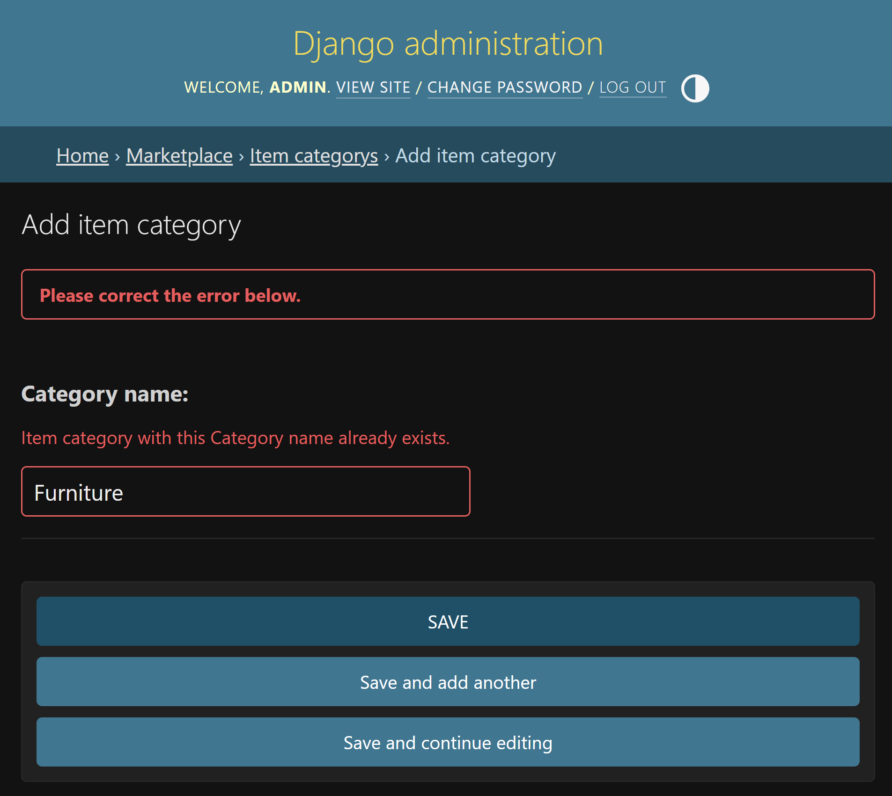
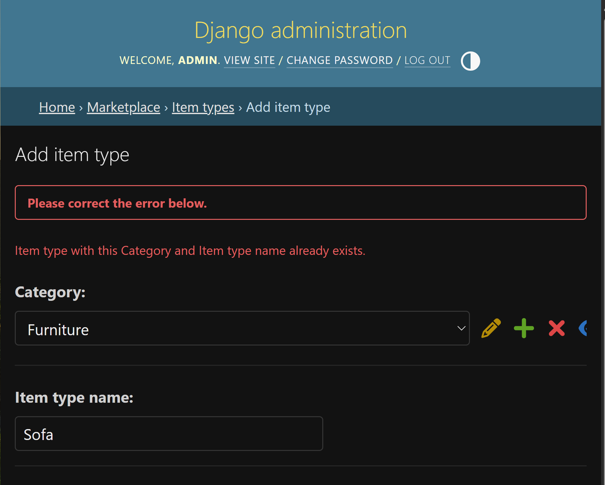
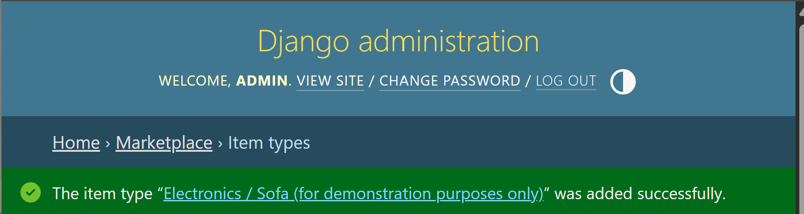
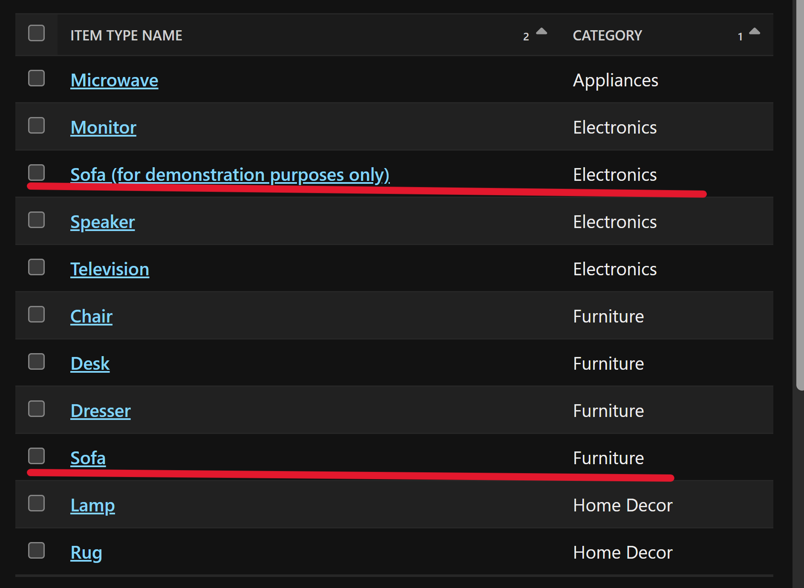
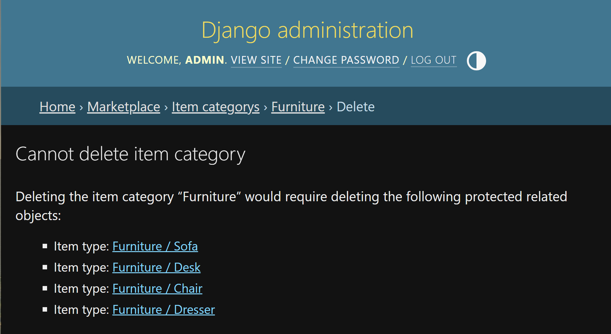
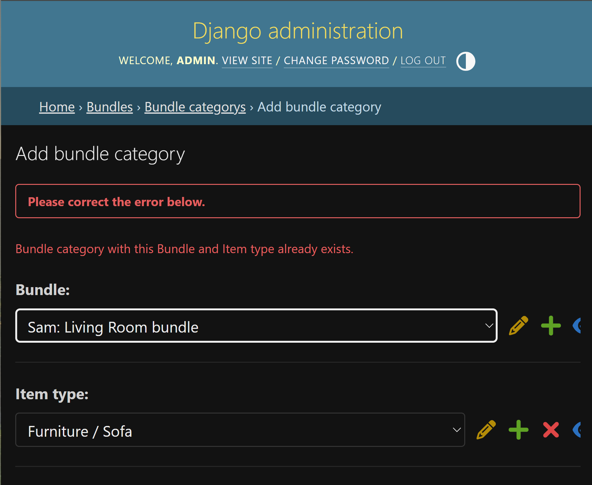
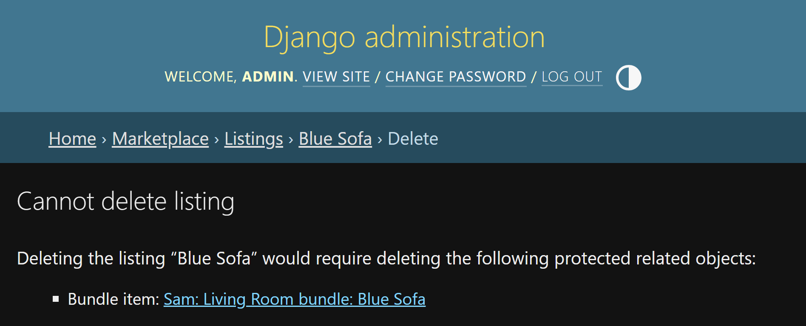
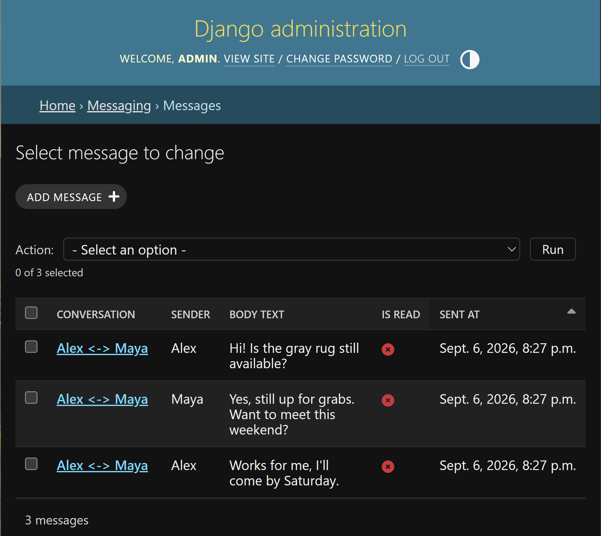

# Constraint Validation Evidence

## Overview

1. **Single-field uniqueness** — `ItemCategory.category_name`: attempted to create a second `Furniture` category; Django Admin rejected the save with a "already exists" validation error before it reached the database.
2. **Multi-field uniqueness** — `ItemType (category, item_type_name)`: created `Sofa` under `Furniture` twice; second attempt was rejected. Creating `Sofa` under a *different* category (`Electronics`) succeeded, confirming the constraint is scoped to the pair, not the name alone.
3. **`PROTECT` behavior (single app)** — attempted to delete the `Furniture` `ItemCategory` while `ItemType` rows referenced it; deletion was blocked.
4. **Multi-field uniqueness (`bundles`)** — attempted to add the same `ItemType` twice to one `Bundle` via `BundleCategory`; second attempt was rejected.
5. **`PROTECT` behavior (cross-app)** — attempted to delete a `Listing` that was attached to a `Bundle` via `BundleItem`; deletion was blocked, proving `Listing -> BundleItem` uses `PROTECT` so bundle history can't silently lose its underlying listings.
6. **`CASCADE` behavior** — created a `Conversation` with 3 `Message` rows, then deleted the `Conversation`; all 3 messages were deleted along with it, confirming `Message.conversation` uses `CASCADE`.

## Validation Demonstrations

### 1. Single-field uniqueness — ItemCategory.category_name
**Goal**: prove that two broad categories cannot have the same name.

**Expected Result**: Django rejects the save because Furniture already exists. The evidence displays an “already exists” uniqueness validation error. No duplicate Furniture row should be created.

**Evidence Screenshot**

### 2. Multi-field uniqueness — ItemType (category, item_type_name)

**Goal**: prove that an item type name only has to be unique within the same category.

#### 2.1) Duplicate pair should fail

**Expected Result**: Django rejects the second Furniture + Sofa combination because that exact pair already exists.

**Evidence Screenshot**

#### 2.2) Same name under a different category should succeed

**Expected Result**: The save succeeds because the uniqueness rule is on the pair (category, item_type_name), not on item_type_name alone.

**Evidence Screenshot**

### 3. PROTECT behavior within one app — ItemType.category -> ItemCategory
**Goal**: prove that a broad category cannot be deleted while Item Types still depend on it.

**Expected Result**: Django blocks the deletion because Item Types such as Sofa, Desk, Chair, and Dresser still reference Furniture.

**Evidence Screenshot**

### 4. Multi-field uniqueness in bundles — BundleCategory (bundle, item_type)
**Goal**: prove that the same requested Item Type cannot be added twice to the same Bundle.

**Expected Result**: Django rejects the save because the Living Room bundle already contains Sofa. This confirms the uniqueness constraint on (bundle, item_type).

**Evidence Screenshot**

### 5. Cross-app PROTECT behavior — BundleItem.listing -> Listing
**Goal**: prove that a Marketplace listing cannot be deleted while a Bundle depends on it.

**Expected Result**: Django blocks deletion because a BundleItem references the Blue Sofa listing.

**Evidence Screenshot**

### 6. CASCADE behavior — Message.conversation -> Conversation
**Goal**: prove that Messages are automatically removed when their parent Conversation is deleted.

**Expected Result**: all 3 Message rows that belonged to the deleted Conversation are gone. This confirms Message.conversation uses CASCADE.

**Evidence Screenshot**

